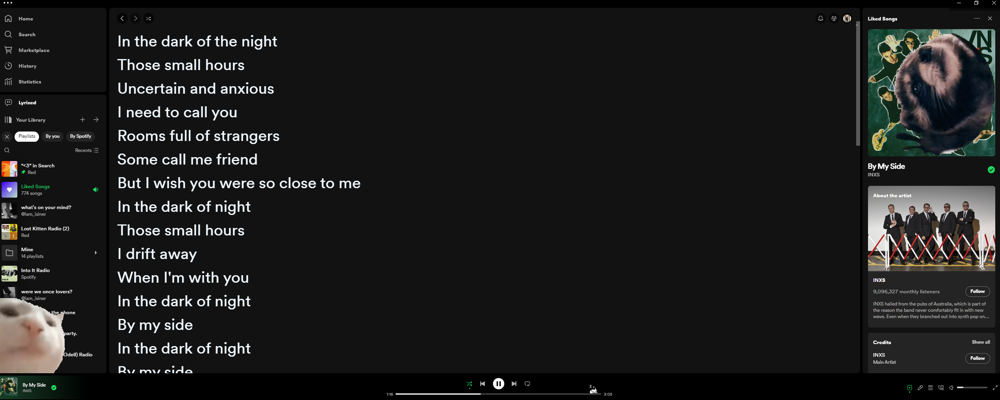

# Lyrixed



Lyrixed is a Spicetify custom app to bring back the lyrics feature to Spotify desktop app for freemium users.

## Installation

Windows: 
 - In your Powershell, Run:
    ```powershell
    [Net.ServicePointManager]::SecurityProtocol = [Net.SecurityProtocolType]::Tls12; Invoke-Expression "& { $(Invoke-WebRequest -UseBasicParsing 'https://raw.githubusercontent.com/Nuzair46/Lyrixed/main/install.ps1') }"
    ```
MacOS/Linux:
- In your terminal, Run:
  ```bash
  curl -fsSL https://raw.githubusercontent.com/Nuzair46/Lyrixed/main/install.sh | sh
  ```

## Uninstallation
- In your terminal, Run:
  ```
  spicetify config custom_apps lyrixed-
  spicetify apply
  ```
## Warning, this is still in early beta, so expect bugs and sometimes the api might not work.

- Feel free to open issue for fixes and features.
- Please give me more stars so I can provide better solution for [cors issue](https://cors.sh/)
